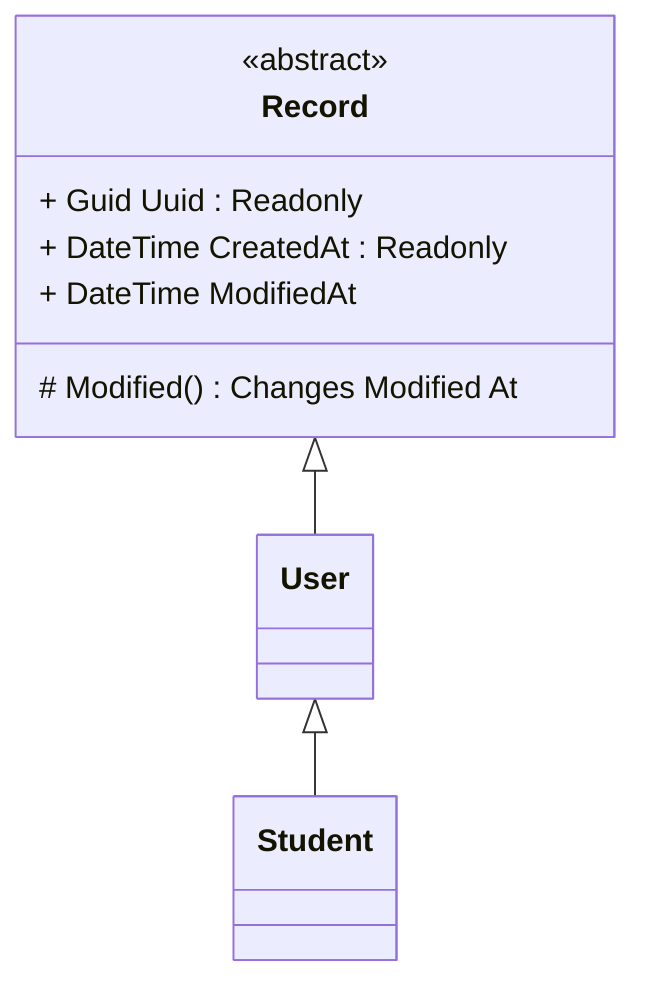

# A Basic User Registiration App

A basic windows-only user registiration application.   

# UML Diagrams

---
| .NET Framework 4.7.2 |
----

Copyright 2026 Bulut BEKDEMIR \
SPDX-License-Identifier: Apache-2.0