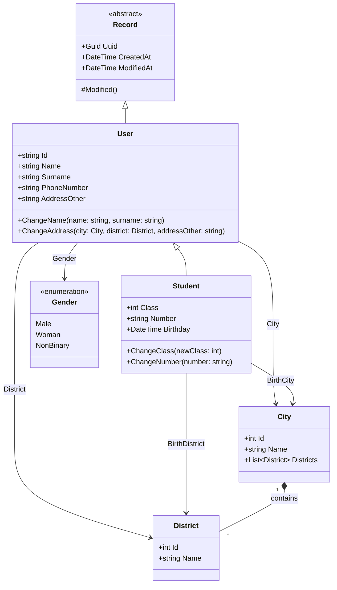

# A Basic User Registiration App

A basic windows-only user registiration application.   

## UML Diagrams

## To-Do
There is a lot of but most importants are:
-  DB Connections 
-  More Data Controls
-  Unit Tests

---
### AI DISCLAIMER

AI tools used to generate and refactor some of code snippets in this project.

---
| .NET Framework 4.7.2 |
----

Copyright 2026 Bulut BEKDEMIR \
SPDX-License-Identifier: Apache-2.0